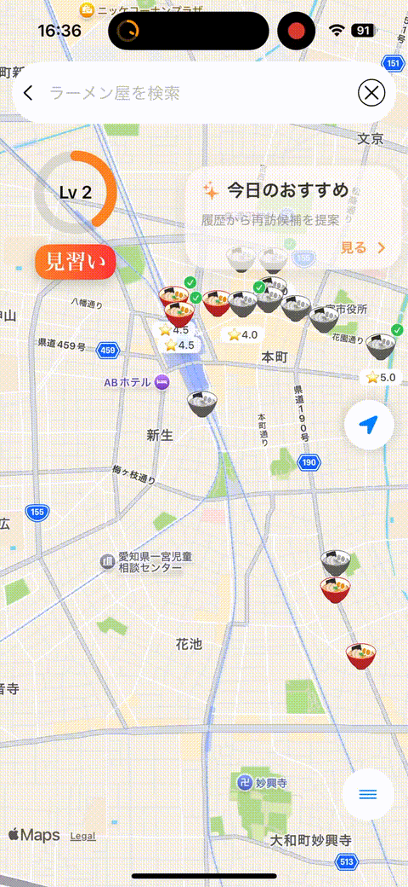

# 麺録

**App Store:**  
https://apps.apple.com/app/%E9%BA%BA%E9%8C%B2/id6767452389

## 目的

ラーメン店巡りを続ける中で、既存のレビューサービスは他者評価が中心であり、自分自身の訪問履歴や好みを次の店選びに活かしづらいと感じました。

そこで、自分のラーメン体験を記録・分析し、蓄積したデータを次の店舗選びや振り返りに活用しながら、ラーメン巡りを継続的に楽しめることを目的として本アプリを開発しました。

## 概要

本アプリは、現在地周辺のラーメン店を地図上に表示し、訪問履歴を記録・分析できるiOSアプリです。

ユーザーのラーメン訪問データを蓄積し、以下のような体験を提供します。

- 嗜好の可視化
- 行動・訪問履歴の振り返り
- 訪問履歴を活用した店舗選び
- レベル・称号によるゲーミフィケーション

### コンセプト

- ラーメン体験のデータ化（食べ歩きログ）
- 訪問履歴による自己分析
- ゲーミフィケーション（レベル・称号）による継続利用の促進

## 使用技術

- Swift
- SwiftUI
- Realm
- MapKit
- Google Places API
- Google Maps
- Git / GitHub

## アプリの基本フロー

**アプリ起動（ContentView）**  
→ 現在地周辺（半径1500m）のラーメン店を地図上に表示

**店舗をタップ**  
→ 店舗詳細（評価・距離・営業時間・経路など）を表示

**訪問操作**  
→ 訪問登録（自己評価・感想）＋経験値付与＋レベルアップ

**各種機能へ遷移**  
→ 検索 / 訪問リスト / 分析 / 診断 / ランキング

## 技術的に工夫した点

### Map表示の状態管理・描画負荷の改善

訪問履歴の更新や地図操作に伴って状態更新が連続し、不要な再描画やフリーズが発生する問題がありました。

原因を調査した結果、Map表示に関する状態更新やデータ取得、描画処理が密接に結びついており、一つの操作から複数の更新が発生していることが分かりました。

そこで、以下の改善を行いました。

- UIとデータ管理の責務を分離
- 更新頻度の高い処理にdebounceを導入
- API検索結果のキャッシュ設計を見直し
- 負荷の高いルート表示処理を外部Mapへ委譲

これらの改善によって状態更新の流れを整理し、Map操作時の安定性を向上させました。

### API利用回数を抑えるキャッシュ設計

現在地周辺の店舗情報取得にはGoogle Places APIを利用しています。

地図操作のたびにAPIへ問い合わせると、同一エリアに対して不要なリクエストが発生するため、取得した店舗情報をローカルに保持する設計としました。

- Google Places APIの利用回数を削減
- 半径100m以内ではローカルキャッシュを利用
- 同一エリアに対する再検索を抑制

これにより、不要な通信とAPI利用回数を抑えています。

## 主要機能

### マップ機能

- 現在地周辺のラーメン店表示
- 訪問済み店舗の可視化（チェックアイコン）
- 営業時間外の店舗を白黒アイコンで表示

### 店舗詳細

- 店名
- Google評価
- 現在地からの距離
- 経路表示
- 営業時間
- 自己評価・感想

### 訪問管理

- 訪問記録（評価・ジャンル・感想）
- 訪問回数管理
- 再訪機能 / 削除機能
- レベル・経験値システム

### 検索機能

- キーワードによる店舗検索
- 非同期で検索を実行
- 検索結果から地図中心位置へ移動

### 訪問マップ

- 訪問済み店舗のみを地図上に表示
- 行動履歴の可視化

### 分析機能

- ジャンル割合
- 平均評価
- 月別訪問回数
- 総訪問数
- レベル

### 診断機能

訪問履歴からユーザーのラーメン嗜好を分析します。

- ジャンル傾向
- エリア傾向
- 訪問履歴をもとにしたタイプ診断

### ランキング機能

- 都道府県別ランキング
- ジャンル別ランキング
- 自己評価をもとにしたランキング

## 技術設計

### データ管理

- `VRamenDatabase`：訪問履歴管理
- `RamenDatabase`：検索結果・キャッシュ管理

### API最適化

- Google Places APIの利用回数削減
- 半径100m以内ではローカルキャッシュを利用
- 同一エリアに対する再検索を抑制

### 状態設計

- 訪問状態管理（未訪問 / 訪問済み / 再訪）
- 営業時間によるUI変化
- レベル・経験値システム

## 開発で意識したこと

### 地図UIと訪問履歴のリアルタイム連動

訪問登録後にMap上の表示にも状態が反映されるよう、訪問データとUIの状態を連動させています。

### 行動データの可視化

単に訪問履歴を保存するだけではなく、ジャンル・地域・評価などのデータを集計し、自分自身の嗜好や行動を振り返れるようにしました。

### ゲーミフィケーション

訪問によって経験値を獲得し、レベルが上昇する仕組みを導入することで、継続的に記録したくなる体験を目指しました。

### 継続的な改善

App Storeで公開した後も、実際の利用やフィードバックをもとに機能追加・UI改善・パフォーマンス改善を継続しています。
